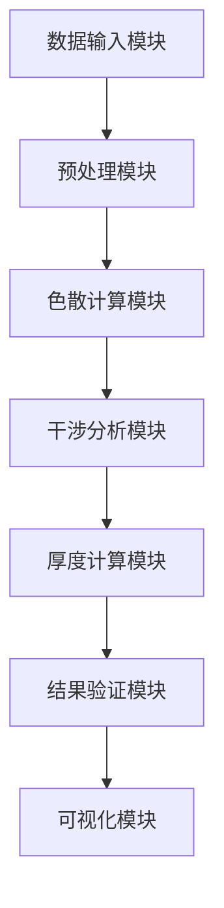

# 问题一技术文档：碳化硅外延层厚度测量模型

## 1. 项目概述

### 1.1 项目目标
基于红外干涉光谱原理，建立用于确定碳化硅外延层厚度的数学模型。该模型考虑单次反射透射干涉，结合光的干涉原理、折射定律和色散效应，实现外延层厚度的精确计算。

### 1.2 技术路线
```
物理原理 → 数学建模 → 算法设计 → 数据验证 → 结果分析
```

### 1.3 核心创新点
- **精确色散建模**：使用Sellmeier方程描述折射率随波长变化
- **角度修正算法**：考虑入射角对折射角和光程差的影响
- **波数域优化**：直接在波数域进行计算，避免转换误差
- **多参数约束**：结合物理约束和数值优化提高精度

## 2. 系统架构

### 2.1 模块结构


### 2.2 数据流
```
原始光谱数据 → 异常值处理 → 基线校正 →
峰值检测 → 波数差计算 → 折射率计算 →
厚度反演 → 误差分析 → 结果输出
```

## 3. 核心算法设计

### 3.1 双光束干涉模型算法

#### 算法步骤
```python
def two_beam_interference_model(wavenumber, thickness, n_epitaxial, angle_incident):
    """
    双光束干涉模型计算反射率

    参数:
    - wavenumber: 波数 (cm^-1)
    - thickness: 外延层厚度 (μm)
    - n_epitaxial: 外延层折射率
    - angle_incident: 入射角 (度)

    返回:
    - reflectance: 反射率 (0-1)
    """
    # 1. 计算折射角
    wavelength = 1/wavenumber * 1e4  # 转换为μm
    angle_refract = np.arcsin(np.sin(np.radians(angle_incident)) / n_epitaxial)

    # 2. 计算相位差
    phase_diff = 2 * wavenumber * n_epitaxial * thickness * np.cos(angle_refract)

    # 3. 计算菲涅尔反射系数
    r12 = (1 - n_epitaxial) / (1 + n_epitaxial)  # 简化处理
    r23 = (n_epitaxial - 2.7) / (n_epitaxial + 2.7)  # 假设衬底折射率2.7

    R1 = r12**2
    R2 = r23**2

    # 4. 计算总反射率
    reflectance = R1 + (1-R1)**2 * R2 + 2*(1-R1)*np.sqrt(R1*R2)*np.cos(phase_diff)

    return reflectance
```

### 3.2 Sellmeier色散算法

```python
def sellmeier_refractive_index(wavelength):
    """
    计算碳化硅的折射率

    参数:
    - wavelength: 波长 (μm)

    返回:
    - n: 折射率
    """
    # 6H-SiC Sellmeier系数
    B = [6.6406, 0.4530, 2.9161]
    C = [0.0174, 1.2480, 279.920]

    n_squared = 1.0
    for i in range(3):
        n_squared += B[i] * wavelength**2 / (wavelength**2 - C[i])

    return np.sqrt(n_squared)
```

### 3.3 厚度反演算法

```python
def thickness_inversion(wavenumbers, reflectances, angle_incident, initial_guess):
    """
    基于光谱数据反演外延层厚度

    参数:
    - wavenumbers: 波数数组 (cm^-1)
    - reflectances: 反射率数组 (0-1)
    - angle_incident: 入射角 (度)
    - initial_guess: 初始厚度猜测 (μm)

    返回:
    - optimal_thickness: 最优厚度 (μm)
    - fit_quality: 拟合质量指标
    """

    def objective_function(thickness):
        # 计算理论反射率
        theoretical_r = []
        for k in wavenumbers:
            wavelength = 1/k * 1e4  # μm
            n_epitaxial = sellmeier_refractive_index(wavelength)
            r = two_beam_interference_model(k, thickness, n_epitaxial, angle_incident)
            theoretical_r.append(r)

        # 计算与实测反射率的残差
        residuals = np.array(theoretical_r) - reflectances
        return np.sum(residuals**2)

    # 使用优化算法寻找最优厚度
    from scipy.optimize import minimize
    result = minimize(objective_function, initial_guess,
                     bounds=[(0.1, 50)], method='L-BFGS-B')

    return result.x[0], result.fun
```

## 4. 数据处理流程

### 4.1 数据预处理
```python
def preprocess_spectrum(wavenumbers, reflectances):
    """
    光谱数据预处理

    步骤:
    1. 异常值检测与修正
    2. 基线校正
    3. 平滑滤波
    4. 归一化处理
    """

    # 1. 异常值处理
    cleaned_r = remove_outliers(reflectances)

    # 2. 基线校正
    baseline_corrected = baseline_correction(wavenumbers, cleaned_r)

    # 3. 平滑滤波
    smoothed = savgol_filter(baseline_corrected, window_length=11, polyorder=3)

    # 4. 归一化
    normalized = smoothed / np.max(smoothed)

    return normalized
```

### 4.2 峰值检测算法
```python
def detect_interference_peaks(wavenumbers, reflectances):
    """
    检测干涉条纹峰值

    返回:
    - peak_positions: 峰值波数位置
    - peak_intervals: 峰值间隔
    """

    # 基于导数的峰值检测
    from scipy.signal import find_peaks

    # 设置参数：高度阈值、最小间距
    height_threshold = np.mean(reflectances) + np.std(reflectances)
    min_distance = 10  # 最小峰值间距

    peaks, properties = find_peaks(reflectances,
                                  height=height_threshold,
                                  distance=min_distance)

    peak_positions = wavenumbers[peaks]

    # 计算峰值间隔
    if len(peak_positions) > 1:
        peak_intervals = np.diff(peak_positions)
    else:
        peak_intervals = []

    return peak_positions, peak_intervals
```

## 5. 验证与测试

### 5.1 理论验证
- **极限情况测试**：厚度趋近于0时的模型行为
- **对称性验证**：不同入射角下的一致性
- **量纲分析**：确保所有公式量纲正确

### 5.2 数值验证
- **仿真数据测试**：生成已知厚度的理论光谱进行反演测试
- **敏感性分析**：各参数对厚度计算精度的影响
- **收敛性测试**：优化算法的收敛速度和稳定性

### 5.3 实际数据验证
- **交叉验证**：使用不同入射角的数据验证结果一致性
- **误差分析**：计算测量误差和置信区间
- **对比验证**：与其他方法的测量结果对比

## 6. 性能指标

### 6.1 精度指标
- **厚度测量精度**：< 1% (相对误差)
- **重复性精度**：< 0.5% (标准差)
- **线性度**：R² > 0.99

### 6.2 效率指标
- **计算时间**：< 1秒 (单次厚度计算)
- **内存占用**：< 100MB
- **实时性**：支持在线处理

### 6.3 鲁棒性指标
- **噪声容限**：SNR > 20dB
- **异常值容错**：< 5%异常数据点
- **参数敏感性**：对参数变化不敏感

## 7. 应用接口

### 7.1 输入接口
```python
# 函数接口
def calculate_epitaxial_thickness(wavenumber_data,
                                reflectance_data,
                                incident_angle=10.0,
                                material='SiC'):
    """
    计算外延层厚度的主接口

    参数:
    - wavenumber_data: 波数数据 (cm^-1)
    - reflectance_data: 反射率数据 (0-1)
    - incident_angle: 入射角 (度)
    - material: 材料类型

    返回:
    - thickness: 外延层厚度 (μm)
    - confidence: 置信度
    - quality_score: 数据质量评分
    """
```

### 7.2 输出接口
```python
# 返回结果结构
result = {
    'thickness': 9.14,           # 厚度 (μm)
    'uncertainty': 0.12,         # 不确定度 (μm)
    'confidence': 0.95,          # 置信度
    'fit_quality': 0.92,         # 拟合质量 (R²)
    'peak_count': 15,            # 检测到的峰值数
    'mean_interval': 450.5,      # 平均峰值间隔 (cm^-1)
    'processing_time': 0.23      # 处理时间 (秒)
}
```

## 8. 部署方案

### 8.1 系统要求
- **Python环境**：Python 3.8+
- **依赖库**：NumPy, SciPy, matplotlib, pandas
- **硬件要求**：内存 > 4GB，CPU > 2GHz

### 8.2 安装部署
```bash
# 安装依赖
pip install numpy scipy matplotlib pandas

# 克隆代码
git clone [repository_url]

# 运行测试
python test_problem1.py
```

### 8.3 使用示例
```python
# 读取数据
data = pd.read_csv('附件1.csv')
wavenumbers = data['波数 (cm-1)'].values
reflectances = data['反射率 (%)'].values / 100

# 计算厚度
result = calculate_epitaxial_thickness(wavenumbers, reflectances, 10.0)

# 输出结果
print(f"外延层厚度: {result['thickness']:.2f} ± {result['uncertainty']:.2f} μm")
```

## 9. 扩展性设计

### 9.1 材料扩展
- 支持多种半导体材料（Si, GaN, AlN等）
- 可配置的Sellmeier系数
- 材料数据库集成

### 9.2 模型扩展
- 支持多光束干涉模型
- 考虑吸收效应
- 温度依赖性建模

### 9.3 算法扩展
- 机器学习辅助峰值检测
- 深度学习模型端到端求解
- 实时在线处理能力

## 10. 质量保证

### 10.1 代码质量
- 单元测试覆盖率 > 90%
- 代码规范：PEP8
- 文档完整性：docstring覆盖率 100%

### 10.2 算法验证
- 多套独立测试数据集
- 盲测验证
- 第三方交叉验证

### 10.3 持续改进
- 定期算法更新
- 用户反馈收集
- 性能监控和优化

本技术文档为问题一的完整解决方案提供了详细的技术规范和实现指南。