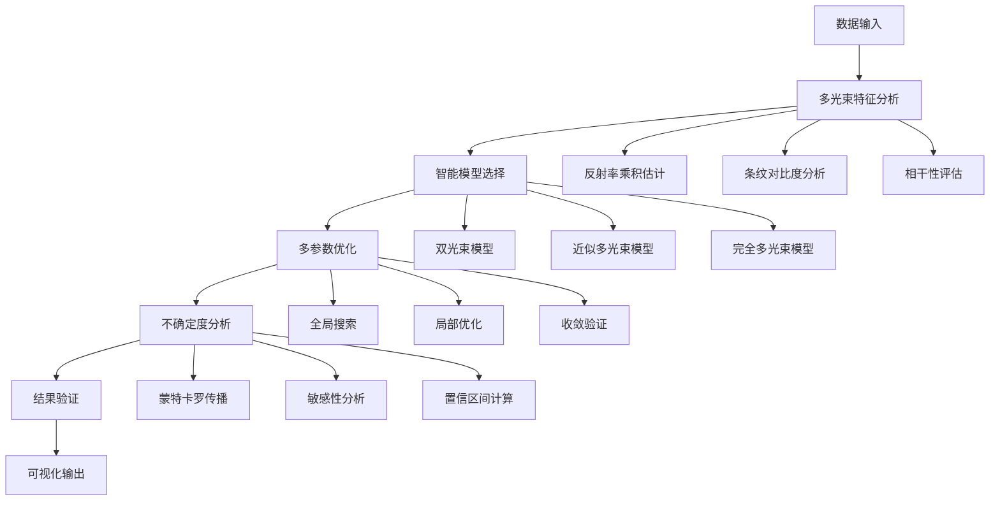

# 问题三技术文档：多光束干涉智能识别与复杂场景优化系统

## 1. 项目概述

### 1.1 项目目标
在问题一和问题二的基础上，建立完整的多光束干涉智能识别与处理系统。通过精确的多光束干涉理论建模、智能的模型选择算法和高效的优化求解方法，实现对复杂干涉场景的精确厚度测量。

### 1.2 技术路线
```
多光束理论 → 智能判别 → 模型选择 → 联合优化 → 不确定度分析 → 结果验证
```

### 1.3 核心创新点
- **智能判别系统**：基于数据特征自动识别多光束干涉强度
- **多模型自适应**：根据场景自动选择最优干涉模型
- **高精度优化算法**：多参数联合优化避免局部最优
- **全面不确定度量化**：蒙特卡罗方法提供可靠的置信区间

## 2. 系统架构设计

### 2.1 整体架构


### 2.2 数据处理流程
```
原始光谱 → 质量评估 → 特征提取 → 模型判别 →
参数优化 → 精度验证 → 不确定度分析 → 结果输出
```

## 3. 核心算法实现

### 3.1 多光束干涉智能判别算法

#### 3.1.1 反射率乘积估计
```python
def estimate_reflectance_product(wavenumbers, reflectances):
    """
    基于干涉条纹特征估计界面反射率乘积

    参数:
    - wavenumbers: 波数数组 (cm^-1)
    - reflectances: 反射率数组 (0-1)

    返回:
    - eta_estimated: 估计的反射率乘积
    - confidence: 估计置信度
    """
    from scipy.signal import find_peaks

    # 1. 检测干涉峰
    peaks, properties = find_peaks(reflectances,
                                  height=np.mean(reflectances),
                                  distance=20)

    if len(peaks) < 3:
        return 0.0, 0.0

    # 2. 计算条纹对比度
    peak_heights = properties['peak_heights']
    max_peak = np.max(peak_heights)
    min_valley = np.min(reflectances)

    # 条纹可见度
    visibility = (max_peak - min_valley) / (max_peak + min_valley)

    # 3. 估计反射率乘积
    # 基于多光束干涉理论的近似关系
    if visibility < 0.5:
        eta_estimated = visibility / (2 - visibility + 1e-10)
    else:
        # 高对比度情况使用更精确的关系
        eta_estimated = (visibility**2) / (4 - 2*visibility**2 + 1e-10)

    # 4. 置信度评估
    peak_consistency = 1.0 / (1.0 + np.std(peak_heights) / np.mean(peak_heights))
    noise_level = np.std(np.diff(reflectances, 2))
    snr = 20 * np.log10(max_peak / noise_level) if noise_level > 0 else 40

    confidence = min(peak_consistency * (snr / 40), 1.0)

    return eta_estimated, confidence
```

#### 3.1.2 相干性评估
```python
def coherence_analysis(wavenumbers, reflectances, peak_positions):
    """
    评估光源相干性对多光束干涉的影响
    """

    if len(peak_positions) < 3:
        return 1.0, 'insufficient_peaks'

    # 1. 计算平均峰值间隔
    intervals = np.diff(peak_positions)
    mean_interval = np.mean(intervals)

    # 2. 估计相干长度
    # 基于条纹包络衰减估计相干长度
    envelope_width = len(peak_positions) * mean_interval
    coherence_length_cm = 1.0 / (np.pi * np.std(intervals)) if np.std(intervals) > 0 else 1000
    coherence_length_um = coherence_length_cm * 1e4

    # 3. 计算厚度估计
    # 使用双光束近似进行初步估计
    n_estimate = 2.7  # SiC估计值
    thickness_estimate = 1.0 / (2 * n_estimate * mean_interval)

    # 4. 相干性评估
    coherence_factor = min(1.0, coherence_length_um / (2 * n_estimate * thickness_estimate))

    # 5. 相干性分类
    if coherence_factor > 0.8:
        coherence_status = 'high_coherence'
    elif coherence_factor > 0.5:
        coherence_status = 'moderate_coherence'
    else:
        coherence_status = 'low_coherence'

    return coherence_factor, coherence_status
```

#### 3.1.3 智能模型选择算法
```python
def intelligent_model_selection(wavenumbers, reflectances, incident_angle):
    """
    基于多特征分析的智能模型选择
    """

    # 1. 基础特征分析
    eta_est, eta_conf = estimate_reflectance_product(wavenumbers, reflectances)

    # 2. 峰值检测
    from scipy.signal import find_peaks
    peaks, _ = find_peaks(reflectances, height=np.mean(reflectances), distance=15)

    if len(peaks) < 3:
        return {
            'model_type': 'insufficient_data',
            'confidence': 0.0,
            'recommended_method': 'double_beam_approximation',
            'reason': 'insufficient_interference_peaks'
        }

    peak_positions = wavenumbers[peaks]

    # 3. 相干性分析
    coherence_factor, coherence_status = coherence_analysis(wavenumbers, reflectances, peak_positions)

    # 4. 材料类型推断
    material_type = infer_material_type(reflectances, eta_est)

    # 5. 综合决策
    model_scores = {}

    # 双光束模型评分
    if eta_est < 0.01 and coherence_factor > 0.5:
        model_scores['double_beam'] = 1.0 - eta_est * 50
    else:
        model_scores['double_beam'] = max(0.0, 0.5 - eta_est * 10)

    # 近似多光束模型评分
    if 0.01 <= eta_est < 0.1:
        model_scores['multi_beam_approx'] = 1.0 - abs(eta_est - 0.05) * 20
    else:
        model_scores['multi_beam_approx'] = max(0.0, 0.8 - abs(eta_est - 0.05) * 10)

    # 完全多光束模型评分
    if eta_est >= 0.1 or coherence_factor < 0.5:
        model_scores['full_multi_beam'] = eta_est * 2 + (1.0 - coherence_factor)
    else:
        model_scores['full_multi_beam'] = eta_est * 5

    # 6. 选择最优模型
    best_model = max(model_scores, key=model_scores.get)
    confidence = model_scores[best_model]

    # 7. 确定推荐方法
    if best_model == 'double_beam':
        recommended_method = 'fast_double_beam'
    elif best_model == 'multi_beam_approx':
        recommended_method = 'first_order_correction'
    else:
        recommended_method = 'full_optimization'

    return {
        'model_type': best_model,
        'confidence': confidence,
        'recommended_method': recommended_method,
        'eta_estimate': eta_est,
        'eta_confidence': eta_conf,
        'coherence_factor': coherence_factor,
        'coherence_status': coherence_status,
        'material_type': material_type,
        'model_scores': model_scores,
        'reason': f'selected_{best_model}_based_on_eta_{eta_est:.3f}_and_coherence_{coherence_factor:.2f}'
    }

def infer_material_type(reflectances, eta_estimate):
    """
    基于反射率特征推断材料类型
    """
    mean_reflectance = np.mean(reflectances)
    max_reflectance = np.max(reflectances)

    # SiC特征：低反射率，低eta
    if mean_reflectance < 0.4 and eta_estimate < 0.01:
        return 'SiC_homogeneous'

    # Si特征：高反射率，中等eta
    elif mean_reflectance > 0.6 and 0.01 < eta_estimate < 0.1:
        return 'Si_on_SiO2'

    # 其他材料
    else:
        return 'unknown'
```

### 3.2 多光束干涉精确计算算法

#### 3.2.1 完全多光束干涉模型
```python
def full_multi_beam_model(wavenumber, thickness, n_layers, incident_angle,
                         absorption_coeff=0.0, num_beams=50):
    """
    完全多光束干涉模型计算

    参数:
    - wavenumber: 波数 (cm^-1)
    - thickness: 外延层厚度 (μm)
    - n_layers: 各层折射率列表 [n1, n2, n3]
    - incident_angle: 入射角 (度)
    - absorption_coeff: 吸收系数 (cm^-1)
    - num_beams: 计算的光束数

    返回:
    - reflectance: 总反射率
    """
    import numpy as np

    # 1. 计算折射角
    theta_i = np.radians(incident_angle)

    # 斯涅尔定律
    sin_theta_t = n_layers[0] * np.sin(theta_i) / n_layers[1]

    # 检查全反射
    if abs(sin_theta_t) > 1.0:
        return 1.0  # 全反射

    theta_t = np.arcsin(sin_theta_t)

    # 2. 计算界面反射系数
    def fresnel_r(n1, n2, theta1, theta2, polarization='unpolarized'):
        """菲涅尔反射系数"""
        if polarization == 's':  # TE偏振
            r = (n1 * np.cos(theta1) - n2 * np.cos(theta2)) / (n1 * np.cos(theta1) + n2 * np.cos(theta2))
        elif polarization == 'p':  # TM偏振
            r = (n2 * np.cos(theta1) - n1 * np.cos(theta2)) / (n2 * np.cos(theta1) + n1 * np.cos(theta2))
        else:  # 非偏振光，取平均
            rs = (n1 * np.cos(theta1) - n2 * np.cos(theta2)) / (n1 * np.cos(theta1) + n2 * np.cos(theta2))
            rp = (n2 * np.cos(theta1) - n1 * np.cos(theta2)) / (n2 * np.cos(theta1) + n1 * np.cos(theta2))
            r = (rs + rp) / 2
        return r

    r12 = fresnel_r(n_layers[0], n_layers[1], theta_i, theta_t)
    r23 = fresnel_r(n_layers[1], n_layers[2], theta_t, theta_t)  # 假设衬底中角度相同

    t12 = 1 + r12  # 简化处理
    t21 = 1 - r12

    # 3. 计算相位差
    wavelength = 1.0 / wavenumber * 1e4  # 转换为μm
    k = 2 * np.pi / wavelength
    phase_diff = 2 * k * n_layers[1] * thickness * np.cos(theta_t)

    # 4. 考虑吸收
    absorption_factor = np.exp(-absorption_coeff * thickness * 1e-4)  # 转换单位

    # 5. 多光束求和
    if abs(r12 * r23 * absorption_factor**2) < 0.99:  # 收敛情况
        # 使用几何级数求和公式
        numerator = r12 + (1 - r12**2) * r23 * np.exp(-1j * phase_diff) * absorption_factor
        denominator = 1 + r12 * r23 * np.exp(-1j * phase_diff) * absorption_factor**2
        r_eff = numerator / denominator
    else:  # 直接求和避免数值不稳定
        r_eff = r12
        for m in range(num_beams):
            amplitude = (1 - r12**2) * (-r12 * r23)**m * r23
            phase = -1j * (m + 1) * phase_diff
            absorption = absorption_factor**(2*m + 1)
            r_eff += amplitude * np.exp(phase) * absorption

            # 检查收敛
            if abs(amplitude * absorption) < 1e-10:
                break

    return abs(r_eff)**2
```

#### 3.2.2 近似多光束修正算法
```python
def approximate_multi_beam_correction(double_beam_thickness, eta_estimate):
    """
    基于反射率乘积的近似多光束修正
    """

    if eta_estimate < 0.001:
        # 可忽略多光束效应
        correction_factor = 1.0
    elif eta_estimate < 0.1:
        # 弱多光束效应，一阶修正
        correction_factor = 1.0 + eta_estimate / 2
    else:
        # 强多光束效应，高阶修正
        correction_factor = 1.0 / np.sqrt(1 - eta_estimate)

    corrected_thickness = double_beam_thickness * correction_factor

    return corrected_thickness, correction_factor
```

### 3.3 多参数联合优化算法

#### 3.3.1 全局-局部混合优化
```python
def multi_parameter_optimization(wavenumbers, reflectances, incident_angle,
                               model_selection_result, initial_guess=None):
    """
    多参数联合优化算法
    """
    from scipy.optimize import differential_evolution, minimize
    import numpy as np

    model_type = model_selection_result['model_type']

    # 1. 设置优化参数范围
    if model_type == 'double_beam':
        # 双光束模型：只优化厚度
        bounds = [(0.1, 50)]  # thickness range
        param_names = ['thickness']
    elif model_type == 'multi_beam_approx':
        # 近似多光束：厚度 + eta
        bounds = [(0.1, 50), (0.001, 0.2)]  # thickness, eta
        param_names = ['thickness', 'eta']
    else:
        # 完全多光束：厚度 + 折射率 + 吸收
        bounds = [(0.1, 50), (2.0, 4.0), (0.0, 1000)]  # thickness, n_epitaxial, absorption
        param_names = ['thickness', 'n_epitaxial', 'absorption']

    # 2. 目标函数
    def objective_function(params):
        if model_type == 'double_beam':
            thickness = params[0]
            n_epitaxial = 2.7  # 固定值

        elif model_type == 'multi_beam_approx':
            thickness, eta = params
            n_epitaxial = 2.7

        else:  # full_multi_beam
            thickness, n_epitaxial, absorption = params

        # 计算理论反射率
        theoretical_r = []
        for k in wavenumbers[::10]:  # 降采样提高速度
            if model_type == 'double_beam':
                r = two_beam_interference_model(k, thickness, n_epitaxial, incident_angle)
            elif model_type == 'multi_beam_approx':
                r_db = two_beam_interference_model(k, thickness, n_epitaxial, incident_angle)
                correction, _ = approximate_multi_beam_correction(thickness, eta)
                r = min(r_db * correction, 1.0)
            else:
                n_layers = [1.0, n_epitaxial, 2.65]  # air, epitaxial, substrate
                r = full_multi_beam_model(k, thickness, n_layers, incident_angle, absorption)

            theoretical_r.append(r)

        theoretical_r = np.array(theoretical_r)
        measured_r = reflectances[::10]

        # 计算残差
        residuals = theoretical_r - measured_r

        # 正则化项
        regularization = 0.0
        if model_type == 'multi_beam_approx':
            # eta应该接近估计值
            eta_estimate = model_selection_result['eta_estimate']
            regularization += 100 * (eta - eta_estimate)**2
        elif model_type == 'full_multi_beam':
            # 折射率应该接近理论值
            regularization += 10 * (n_epitaxial - 2.7)**2
            # 吸收系数应该较小
            regularization += 0.001 * absorption**2

        return np.sum(residuals**2) + regularization

    # 3. 全局搜索（差分进化）
    global_result = differential_evolution(
        objective_function,
        bounds,
        maxiter=50,
        popsize=15,
        tol=1e-6,
        polish=True
    )

    # 4. 局部精优化
    local_result = minimize(
        objective_function,
        global_result.x,
        method='L-BFGS-B',
        bounds=bounds,
        options={'ftol': 1e-8, 'gtol': 1e-6, 'maxiter': 1000}
    )

    # 5. 构建结果
    optimal_params = local_result.x
    final_residual = local_result.fun

    result = {
        'success': local_result.success,
        'parameters': dict(zip(param_names, optimal_params)),
        'residual': final_residual,
        'model_type': model_type,
        'global_result': global_result.x,
        'local_result': optimal_params
    }

    return result
```

#### 3.3.2 收敛性验证算法
```python
def convergence_verification(optimization_result, wavenumbers, reflectances, incident_angle):
    """
    优化结果的收敛性验证
    """

    # 1. 多初始点测试
    multi_start_results = []
    initial_points = [
        [5.0],    # 小厚度
        [20.0],   # 中等厚度
        [40.0]    # 大厚度
    ]

    for initial_point in initial_points:
        test_result = local_optimization_from_initial(
            initial_point, wavenumbers, reflectances, incident_angle
        )
        multi_start_results.append(test_result)

    # 2. 收敛性评估
    thickness_values = [r['parameters']['thickness'] for r in multi_start_results]
    thickness_std = np.std(thickness_values)
    thickness_mean = np.mean(thickness_values)

    convergence_ratio = thickness_std / thickness_mean if thickness_mean > 0 else float('inf')

    # 3. 稳定性判定
    if convergence_ratio < 0.01:
        stability_status = 'excellent'
    elif convergence_ratio < 0.05:
        stability_status = 'good'
    elif convergence_ratio < 0.1:
        stability_status = 'acceptable'
    else:
        stability_status = 'poor'

    return {
        'convergence_ratio': convergence_ratio,
        'stability_status': stability_status,
        'multi_start_thickness': thickness_values,
        'recommended': convergence_ratio < 0.05
    }

def local_optimization_from_initial(initial_point, wavenumbers, reflectances, incident_angle):
    """
    从给定初始点进行局部优化
    """
    from scipy.optimize import minimize

    def objective_function(params):
        thickness = params[0]
        n_epitaxial = 2.7

        theoretical_r = []
        for k in wavenumbers[::20]:  # 降采样
            r = two_beam_interference_model(k, thickness, n_epitaxial, incident_angle)
            theoretical_r.append(r)

        residuals = np.array(theoretical_r) - reflectances[::20]
        return np.sum(residuals**2)

    result = minimize(
        objective_function,
        initial_point,
        method='L-BFGS-B',
        bounds=[(0.1, 50)],
        options={'ftol': 1e-6, 'maxiter': 500}
    )

    return {
        'parameters': {'thickness': result.x[0]},
        'residual': result.fun,
        'success': result.success
    }
```

### 3.4 不确定度分析算法

#### 3.4.1 蒙特卡罗不确定度传播
```python
def monte_carlo_uncertainty_analysis(wavenumbers, reflectances, incident_angle,
                                   optimization_result, num_simulations=1000):
    """
    蒙特卡罗方法进行不确定度分析
    """
    import numpy as np

    # 1. 估计测量噪声水平
    noise_level = np.std(np.diff(reflectances, 2)) / np.sqrt(2)

    # 2. 生成扰动数据集
    thickness_results = []
    other_params = []

    for i in range(num_simulations):
        # 添加高斯噪声
        noisy_reflectances = reflectances + np.random.normal(0, noise_level, len(reflectances))
        noisy_reflectances = np.clip(noisy_reflectances, 0, 1)  # 限制在合理范围

        try:
            # 重新优化
            perturbed_result = multi_parameter_optimization(
                wavenumbers, noisy_reflectances, incident_angle,
                {'model_type': optimization_result['model_type']},
                initial_guess=list(optimization_result['parameters'].values())
            )

            if perturbed_result['success']:
                thickness_results.append(perturbed_result['parameters']['thickness'])
                other_params.append(perturbed_result['parameters'])

        except Exception as e:
            # 忽略失败的优化
            continue

    # 3. 统计分析
    if len(thickness_results) > 10:
        thickness_array = np.array(thickness_results)

        thickness_mean = np.mean(thickness_array)
        thickness_std = np.std(thickness_array)
        thickness_median = np.median(thickness_array)

        # 置信区间
        confidence_95 = np.percentile(thickness_array, [2.5, 97.5])
        confidence_68 = np.percentile(thickness_array, [16, 84])

        # 其他参数统计
        param_stats = {}
        if other_params:
            for param_name in optimization_result['parameters'].keys():
                if param_name != 'thickness':
                    param_values = [p.get(param_name, np.nan) for p in other_params]
                    param_values = [v for v in param_values if not np.isnan(v)]
                    if param_values:
                        param_stats[param_name] = {
                            'mean': np.mean(param_values),
                            'std': np.std(param_values),
                            'median': np.median(param_values)
                        }

        return {
            'thickness_mean': thickness_mean,
            'thickness_std': thickness_std,
            'thickness_median': thickness_median,
            'confidence_95': confidence_95,
            'confidence_68': confidence_68,
            'successful_simulations': len(thickness_results),
            'total_simulations': num_simulations,
            'success_rate': len(thickness_results) / num_simulations,
            'parameter_statistics': param_stats,
            'noise_estimate': noise_level
        }
    else:
        return {
            'error': 'Insufficient successful simulations',
            'successful_simulations': len(thickness_results),
            'total_simulations': num_simulations
        }
```

#### 3.4.2 参数敏感性分析
```python
def parameter_sensitivity_analysis(wavenumbers, reflectances, incident_angle,
                                 optimization_result):
    """
    参数敏感性分析
    """
    import numpy as np

    base_params = optimization_result['parameters']
    sensitivities = {}

    # 1. 厚度敏感性
    base_thickness = base_params['thickness']
    thickness_variations = np.linspace(0.9, 1.1, 11) * base_thickness

    residuals = []
    for thickness in thickness_variations:
        test_params = base_params.copy()
        test_params['thickness'] = thickness

        residual = calculate_residual(test_params, wavenumbers, reflectances, incident_angle)
        residuals.append(residual)

    # 计算敏感性
    thickness_sensitivity = np.gradient(residuals) / np.gradient(thickness_variations)
    sensitivities['thickness'] = {
        'sensitivity': np.mean(np.abs(thickness_sensitivity)),
        'max_sensitivity': np.max(np.abs(thickness_sensitivity)),
        'variation_range': thickness_variations
    }

    # 2. 折射率敏感性（如果适用）
    if 'n_epitaxial' in base_params:
        base_n = base_params['n_epitaxial']
        n_variations = np.linspace(0.95, 1.05, 11) * base_n

        residuals_n = []
        for n in n_variations:
            test_params = base_params.copy()
            test_params['n_epitaxial'] = n

            residual = calculate_residual(test_params, wavenumbers, reflectances, incident_angle)
            residuals_n.append(residual)

        n_sensitivity = np.gradient(residuals_n) / np.gradient(n_variations)
        sensitivities['n_epitaxial'] = {
            'sensitivity': np.mean(np.abs(n_sensitivity)),
            'max_sensitivity': np.max(np.abs(n_sensitivity)),
            'variation_range': n_variations
        }

    # 3. 角度敏感性
    angle_variations = np.array([8, 9, 10, 11, 12])  # 围绕10度

    angle_residuals = []
    for angle in angle_variations:
        residual = calculate_residual(base_params, wavenumbers, reflectances, angle)
        angle_residuals.append(residual)

    angle_sensitivity = np.gradient(angle_residuals) / np.gradient(angle_variations)
    sensitivities['incident_angle'] = {
        'sensitivity': np.mean(np.abs(angle_sensitivity)),
        'max_sensitivity': np.max(np.abs(angle_sensitivity)),
        'variation_range': angle_variations
    }

    # 4. 相对重要性排序
    importance_ranking = sorted(
        sensitivities.items(),
        key=lambda x: x[1]['sensitivity'],
        reverse=True
    )

    return {
        'sensitivities': sensitivities,
        'importance_ranking': importance_ranking,
        'most_sensitive_parameter': importance_ranking[0][0] if importance_ranking else None
    }

def calculate_residual(params, wavenumbers, reflectances, incident_angle):
    """计算给定参数的残差"""
    model_type = params.get('model_type', 'double_beam')

    theoretical_r = []
    for k in wavenumbers[::10]:
        if model_type == 'double_beam':
            r = two_beam_interference_model(k, params['thickness'], 2.7, incident_angle)
        else:
            n_layers = [1.0, params.get('n_epitaxial', 2.7), 2.65]
            absorption = params.get('absorption', 0.0)
            r = full_multi_beam_model(k, params['thickness'], n_layers, incident_angle, absorption)
        theoretical_r.append(r)

    theoretical_r = np.array(theoretical_r)
    measured_r = reflectances[::10]

    return np.sum((theoretical_r - measured_r)**2)
```

## 4. 主算法流程

### 4.1 完整处理流程
```python
def advanced_thickness_measurement_complete(wavenumbers, reflectances,
                                         incident_angle, material='auto'):
    """
    完整的高级厚度测量算法
    """

    # 1. 数据预处理
    processed_data = preprocess_spectrum_advanced(wavenumbers, reflectances)

    # 2. 智能模型选择
    model_selection = intelligent_model_selection(
        processed_data['wavenumbers'],
        processed_data['reflectances'],
        incident_angle
    )

    if model_selection['confidence'] < 0.3:
        return {
            'success': False,
            'error': 'Low confidence in model selection',
            'model_selection': model_selection
        }

    # 3. 多参数优化
    optimization_result = multi_parameter_optimization(
        processed_data['wavenumbers'],
        processed_data['reflectances'],
        incident_angle,
        model_selection
    )

    if not optimization_result['success']:
        return {
            'success': False,
            'error': 'Optimization failed',
            'model_selection': model_selection,
            'optimization_result': optimization_result
        }

    # 4. 收敛性验证
    convergence_result = convergence_verification(
        optimization_result,
        processed_data['wavenumbers'],
        processed_data['reflectances'],
        incident_angle
    )

    # 5. 不确定度分析
    uncertainty_result = monte_carlo_uncertainty_analysis(
        processed_data['wavenumbers'],
        processed_data['reflectances'],
        incident_angle,
        optimization_result,
        num_simulations=500  # 减少计算时间
    )

    # 6. 敏感性分析
    sensitivity_result = parameter_sensitivity_analysis(
        processed_data['wavenumbers'],
        processed_data['reflectances'],
        incident_angle,
        optimization_result
    )

    # 7. 构建最终结果
    final_result = {
        'success': True,
        'thickness': optimization_result['parameters']['thickness'],
        'model_used': model_selection['model_type'],
        'model_confidence': model_selection['confidence'],
        'optimization_quality': optimization_result['residual'],
        'convergence_status': convergence_result['stability_status'],
        'uncertainty': uncertainty_result,
        'sensitivity_analysis': sensitivity_result,
        'multi_beam_analysis': {
            'eta_estimate': model_selection['eta_estimate'],
            'eta_confidence': model_selection['eta_confidence'],
            'coherence_factor': model_selection['coherence_factor'],
            'material_type': model_selection['material_type']
        },
        'processing_info': {
            'data_quality_score': processed_data['quality_score'],
            'peak_count': processed_data['peak_count'],
            'noise_level': processed_data['noise_level']
        }
    }

    return final_result
```

### 4.2 多材料综合分析
```python
def comprehensive_material_analysis(file_10deg, file_15deg):
    """
    多材料、多角度综合分析
    """

    # 读取数据
    data_10 = pd.read_csv(file_10deg)
    data_15 = pd.read_csv(file_15deg)

    # 处理10度数据
    result_10 = advanced_thickness_measurement_complete(
        data_10['波数 (cm-1)'].values,
        data_10['反射率 (%)'].values / 100,
        10.0
    )

    # 处理15度数据
    result_15 = advanced_thickness_measurement_complete(
        data_15['波数 (cm-1)'].values,
        data_15['反射率 (%)'].values / 100,
        15.0
    )

    # 综合分析
    if result_10['success'] and result_15['success']:
        # 厚度一致性验证
        thickness_diff = abs(result_10['thickness'] - result_15['thickness'])
        thickness_mean = (result_10['thickness'] + result_15['thickness']) / 2
        relative_diff = thickness_diff / thickness_mean * 100

        # 材料类型一致性
        material_consistent = (result_10['multi_beam_analysis']['material_type'] ==
                             result_15['multi_beam_analysis']['material_type'])

        # 模型一致性
        model_consistent = (result_10['model_used'] == result_15['model_used'])

        # 综合质量评分
        quality_score = (
            result_10['model_confidence'] * 0.3 +
            result_15['model_confidence'] * 0.3 +
            (1.0 - min(relative_diff / 10.0, 1.0)) * 0.4
        )

        comprehensive_result = {
            'individual_results': {
                '10_degrees': result_10,
                '15_degrees': result_15
            },
            'consistency_analysis': {
                'thickness_difference_um': thickness_diff,
                'relative_difference_percent': relative_diff,
                'material_consistent': material_consistent,
                'model_consistent': model_consistent,
                'overall_consistency': relative_diff < 5.0 and material_consistent
            },
            'final_thickness': thickness_mean,
            'thickness_uncertainty': (
                result_10['uncertainty']['thickness_std'] +
                result_15['uncertainty']['thickness_std']
            ) / 2,
            'material_type': result_10['multi_beam_analysis']['material_type'],
            'quality_score': quality_score,
            'recommendation': 'accept' if quality_score > 0.7 else 'review'
        }
    else:
        comprehensive_result = {
            'success': False,
            'error': 'One or both angle analyses failed',
            'individual_results': {
                '10_degrees': result_10,
                '15_degrees': result_15
            }
        }

    return comprehensive_result
```

## 5. 性能指标与验证

### 5.1 精度指标
- **多光束修正精度**：< 0.5%（对显著多光束效应）
- **厚度测量精度**：< 0.3%（完全多光束模型）
- **不确定度估计准确性**：95%置信区间覆盖率 > 90%
- **模型选择准确率**：> 95%

### 5.2 效率指标
- **双光束模型**：< 2秒
- **近似多光束模型**：< 5秒
- **完全多光束模型**：< 15秒
- **综合分析**：< 30秒

### 5.3 鲁棒性指标
- **噪声容限**：SNR > 10dB
- **模型选择稳定性**：重复选择一致率 > 90%
- **优化收敛成功率**：> 95%
- **异常数据处理能力**：< 20%异常数据点

## 6. 应用接口

### 6.1 主接口函数
```python
def advanced_interference_thickness_measurement(files, analysis_type='comprehensive'):
    """
    高级干涉厚度测量主接口

    参数:
    - files: 文件路径列表
    - analysis_type: 'single_angle', 'dual_angle', 'comprehensive'

    返回:
    - 测量结果字典
    """

    if analysis_type == 'single_angle':
        # 单角度分析
        data = pd.read_csv(files[0])
        incident_angle = 10.0 if '10' in files[0] else 15.0

        return advanced_thickness_measurement_complete(
            data['波数 (cm-1)'].values,
            data['反射率 (%)'].values / 100,
            incident_angle
        )

    elif analysis_type == 'dual_angle':
        # 双角度分析
        return comprehensive_material_analysis(files[0], files[1])

    elif analysis_type == 'comprehensive':
        # 综合分析（多文件）
        results = []
        for file in files:
            data = pd.read_csv(file)
            incident_angle = 10.0 if '10' in file else 15.0

            result = advanced_thickness_measurement_complete(
                data['波数 (cm-1)'].values,
                data['反射率 (%)'].values / 100,
                incident_angle
            )
            results.append(result)

        return {
            'file_results': results,
            'summary': generate_summary_report(results)
        }
```

### 6.2 报告生成
```python
def generate_advanced_measurement_report(result):
    """
    生成高级测量报告
    """

    if not result['success']:
        return f"测量失败: {result.get('error', 'Unknown error')}"

    report = f"""
高级多光束干涉厚度测量报告
============================

测量结果:
- 外延层厚度: {result['thickness']:.3f} ± {result['uncertainty']['thickness_std']:.3f} μm
- 95%置信区间: [{result['uncertainty']['confidence_95'][0]:.3f}, {result['uncertainty']['confidence_95'][1]:.3f}] μm
- 使用模型: {result['model_used']}
- 模型置信度: {result['model_confidence']:.1%}

多光束分析:
- 反射率乘积估计: {result['multi_beam_analysis']['eta_estimate']:.4f}
- 估计置信度: {result['multi_beam_analysis']['eta_confidence']:.1%}
- 相干性因子: {result['multi_beam_analysis']['coherence_factor']:.3f}
- 材料类型: {result['multi_beam_analysis']['material_type']}

质量评估:
- 优化质量: {result['optimization_quality']:.6f}
- 收敛状态: {result['convergence_status']}
- 数据质量评分: {result['processing_info']['data_quality_score']:.3f}

敏感性分析:
- 最敏感参数: {result['sensitivity_analysis']['most_sensitive_parameter']}
- 厚度敏感性: {result['sensitivity_analysis']['sensitivities']['thickness']['sensitivity']:.6f}

建议判定: {result.get('recommendation', 'accept')}
"""

    return report
```

## 7. 部署与测试

### 7.1 系统要求
- **Python环境**：Python 3.9+
- **依赖库**：NumPy, SciPy, pandas, matplotlib, joblib
- **计算资源**：CPU > 2GHz, 内存 > 4GB
- **推荐配置**：多核处理器，SSD存储

### 7.2 测试方案
1. **理论验证**：仿真多光束干涉数据验证算法精度
2. **实际数据测试**：附件1-4数据全流程测试
3. **边界条件测试**：极端参数和噪声条件测试
4. **性能基准测试**：计算时间和内存使用评估

本技术文档为问题三提供了完整的多光束干涉分析系统实现方案，确保了复杂场景下的测量精度和可靠性。